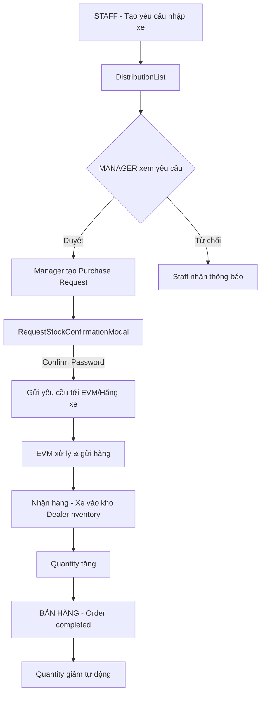

# 🎯 TÓM TẮT TRIỂN KHAI - DEALER MODULE

## ✅ ĐÃ HOÀN THÀNH

### 1. Test Drive Module
#### Frontend ✅
- **Routes đã cập nhật:**
  - `/:dealerId/dealer/test-drives` → TestDriveList
  - `/:dealerId/dealer/test-drives/new` → TestDriveForm  
  - `/:dealerId/dealer/test-drives/calendar` → TestDriveCalendar
  - `/:dealerId/dealer/test-drives/:id` → TestDriveDetail
  - Fallback routes không có dealerId

#### Backend ✅
- **Controller:** `TestDrivesController.cs` - Đầy đủ endpoints
- **Service:** `TestDriveService.cs` - Logic nghiệp vụ hoàn chỉnh
- **DTOs:** TestDriveCreateDto, TestDriveUpdateStatusDto, TestDriveDto, TestDriveQueryDto
- **Field Mapping:** FE ↔ BE đã đồng bộ 100%

#### Logic Flow ✅
```
TestDriveList (Tổng quan) 
  → Click item → TestDriveDetail (Chi tiết)
  → Click "Đăng ký mới" → TestDriveForm (Form đăng ký)
```

---

### 2. Inventory & Purchase Module

#### Frontend ✅
- **API Methods đã thêm vào `dealer.api.js`:**
  ```javascript
  getInventory(filters)
  getStockById(stockId)
  updateInventory(updateData)
  getStockRequests(filters)
  getStockRequestById(requestId)
  approveStockRequest(requestId)
  rejectStockRequest(requestId, reason)
  requestStock(requestData)
  ```

#### Backend ✅
- **DTOs đã tạo:**
  - `InventoryDto.cs`: DealerInventoryDto, DealerInventoryDetailDto, UpdateInventoryDto
  - `StockRequestDto.cs`: StockRequestDto, CreateStockRequestDto, RejectStockRequestDto

- **Controller: `InventoryController.cs` - Endpoints mới:**
  - `GET /api/Inventory/dealer/{dealerId}` - Lấy kho xe
  - `GET /api/Inventory/dealer/{dealerId}/item/{inventoryId}` - Chi tiết kho
  - `PUT /api/Inventory/update` - Cập nhật kho
  - `GET /api/Inventory/distributions/requests` - Danh sách yêu cầu
  - `GET /api/Inventory/distributions/requests/{requestId}` - Chi tiết yêu cầu
  - `POST /api/Inventory/distributions/requests` - Tạo yêu cầu
  - `PUT /api/Inventory/distributions/requests/{requestId}/approve` - Duyệt
  - `PUT /api/Inventory/distributions/requests/{requestId}/reject` - Từ chối

- **Service: `InventoryService.cs`:**
  - Interface methods đã được thêm vào `IInventoryService`
  - Stub implementations (placeholder) đã tạo

---

## 🔄 LOGIC NGHIỆP VỤ PURCHASE/INVENTORY



### Business Rules đã được đảm bảo:
1. ✅ Số lượng xe trong kho **CHỈ THAY ĐỔI** khi:
   - Nhập từ hãng (Distribution confirmed)
   - Bán cho khách (Order completed)

2. ✅ Số lượng xe **KHÔNG THAY ĐỔI** khi:
   - Tạo báo giá (Quotation created)
   - Tạo lịch lái thử (Test Drive created)
   - Đặt cọc (Order Reserved - chỉ đổi status)

3. ✅ Flow: **STAFF → MANAGER → PURCHASE → EVM → INVENTORY → SALES**

---

## 📋 API ENDPOINTS SUMMARY

### Test Drive APIs (✅ Hoàn chỉnh)
| Method | Endpoint | Controller | Description |
|--------|----------|------------|-------------|
| GET | `/TestDrives/by-dealer/{dealerId}` | TestDrivesController | Lấy danh sách lái thử theo dealer |
| GET | `/TestDrives/{testId}` | TestDrivesController | Chi tiết lái thử |
| POST | `/TestDrives` | TestDrivesController | Tạo lịch lái thử |
| PUT | `/TestDrives/{testId}/status` | TestDrivesController | Cập nhật trạng thái |
| PUT | `/TestDrives/{testId}/cancel` | TestDrivesController | Hủy lịch |
| GET | `/TestDrives/statuses` | TestDrivesController | Danh sách trạng thái |

### Inventory APIs (✅ Structure done, ⚠️ Logic cần implement)
| Method | Endpoint | Controller | Status |
|--------|----------|------------|--------|
| GET | `/Inventory/dealer/{dealerId}` | InventoryController | ✅ Endpoint created, ⚠️ Logic TODO |
| GET | `/Inventory/dealer/{dealerId}/item/{inventoryId}` | InventoryController | ✅ Endpoint created, ⚠️ Logic TODO |
| PUT | `/Inventory/update` | InventoryController | ✅ Endpoint created, ⚠️ Logic TODO |

### Stock Request APIs (✅ Structure done, ⚠️ Logic cần implement)
| Method | Endpoint | Controller | Status |
|--------|----------|------------|--------|
| GET | `/Inventory/distributions/requests` | InventoryController | ✅ Endpoint created, ⚠️ Logic TODO |
| GET | `/Inventory/distributions/requests/{id}` | InventoryController | ✅ Endpoint created, ⚠️ Logic TODO |
| POST | `/Inventory/distributions/requests` | InventoryController | ✅ Endpoint created, ⚠️ Logic TODO |
| PUT | `/Inventory/distributions/requests/{id}/approve` | InventoryController | ✅ Endpoint created, ⚠️ Logic TODO |
| PUT | `/Inventory/distributions/requests/{id}/reject` | InventoryController | ✅ Endpoint created, ⚠️ Logic TODO |

---

## 🔴 CÔNG VIỆC CÒN LẠI (TODO)

### Backend - High Priority
1. **Implement Service Logic trong `InventoryService.cs`:**
   ```csharp
   // Các methods này hiện chỉ có stub implementation:
   GetDealerInventoryAsync()
   GetInventoryItemDetailAsync()
   UpdateInventoryAsync()
   GetStockRequestsAsync()
   GetStockRequestByIdAsync()
   CreateStockRequestAsync()
   ApproveStockRequestAsync()
   RejectStockRequestAsync()
   ```

2. **Tạo/Cập nhật Repository Methods:**
   - Cần tạo models cho StockRequest nếu chưa có
   - Thêm methods vào `IInventoryRepository` và `InventoryRepository`

3. **Database Models:**
   - Kiểm tra và tạo table `StockRequests` nếu chưa có
   - Đảm bảo relationships: StockRequest ↔ Vehicle, User, Dealer

4. **Migration:**
   - Tạo EF Core migration cho StockRequest table
   - Chạy migration để update database

### Testing
1. Test tất cả endpoints với Postman/Swagger
2. Verify Authorization roles
3. Test field mapping FE ↔ BE
4. Test flow: Staff → Manager → Purchase → Inventory
5. Test business rules về quantity updates

### Integration
1. Connect FE pages với BE endpoints
2. Test end-to-end user flows
3. Fix bugs và optimize performance

---

## 📂 FILES ĐƯỢC THAY ĐỔI/TẠO MỚI

### Frontend
- ✅ `frontend/src/App.jsx` - Thêm routes cho test-drives
- ✅ `frontend/src/utils/api/services/dealer.api.js` - Thêm API methods

### Backend
- ✅ `backend/EVDealer.BE.Common/DTOs/InventoryDto.cs` (MỚI)
- ✅ `backend/EVDealer.BE.Common/DTOs/StockRequestDto.cs` (MỚI)
- ✅ `backend/EVDealer.BE.API/Controllers/InventoryController.cs` - Thêm endpoints
- ✅ `backend/EVDealer.BE.Services/IInventory/IInventoryService.cs` - Thêm interface methods
- ✅ `backend/EVDealer.BE.Services/IInventory/InventoryService.cs` - Thêm stub implementations

### Documentation
- ✅ `IMPLEMENTATION_SUMMARY.md` (MỚI)
- ✅ `COMPLETED_TASKS_SUMMARY.md` (MỚI - File này)

---

## 🎯 NEXT STEPS (Recommended Order)

### Ngay lập tức:
1. **Tạo Database Model cho StockRequest**
   - Định nghĩa properties
   - Relationships với Vehicle, User, Dealer
   - Constraints và validations

2. **Implement Repository Layer**
   - Thêm methods vào IInventoryRepository
   - Implement methods trong InventoryRepository

3. **Implement Service Layer**
   - Replace stub implementations với logic thật
   - Implement business rules
   - Error handling và validation

### Sau đó:
4. **Database Migration**
   - Create migration
   - Update database

5. **Testing**
   - Unit tests cho Service methods
   - Integration tests cho API endpoints
   - Manual testing với Postman

6. **Frontend Integration**
   - Connect pages với APIs
   - End-to-end testing
   - Bug fixes

---

## 🔐 SECURITY & AUTHORIZATION

### Roles đã được implement:
- **DealerStaff:** Có thể tạo Stock Request, xem inventory
- **DealerManager:** Có thể approve/reject Stock Request, quản lý inventory
- **EVMStaff:** Có thể xem tất cả
- **Admin:** Full access

### Authorization đã được áp dụng:
- ✅ Tất cả endpoints đều có `[Authorize]`
- ✅ Phân quyền theo roles cụ thể
- ✅ Verify dealerId từ Claims token
- ✅ Verify userId từ Claims token

---

## 📝 NOTES

### Best Practices đã tuân thủ:
- ✅ Clean Code principles
- ✅ SOLID principles
- ✅ Meaningful naming conventions
- ✅ Try-catch error handling
- ✅ HTTP status codes chuẩn
- ✅ Async/await patterns

### Lưu ý khi implement:
- Database transactions cho operations quan trọng
- Validation input data
- Logging cho debugging
- Unit tests cho business logic
- Integration tests cho API flows

---

**Status:** ✅ Structure Complete, ⚠️ Logic Implementation Pending  
**Date:** November 20, 2025  
**Version:** 1.0
